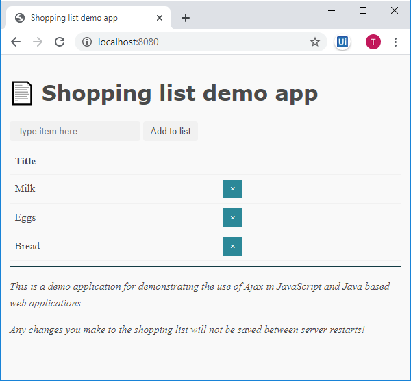

# Shopping List -esimerkkisovellus

Tämän projektin on tarkoitus esitellä Haaga-Helian [Ohjelmointi 2](https://opinto-opas.haaga-helia.fi/course_unit/SWD4TN033) -opintojaksolla käsiteltäviä web-teknologioita käytännössä.

Tähän dokumenttiin sekä tässä samassa Git-repositoriossa sijaitsevaan valmiiseen koodiin perehtymällä saat peruskäsityksen yksinkertaistetun verkkosovelluksen toteuttamisesta Javalla, Servleteillä, JavaScriptillä sekä Ajax-teknologioilla. Esimerkkisovelluksesta on jätetty pois oikeassa verkkopalvelussa oleellisia ominaisuuksia, kuten käyttäjän tunnistautuminen, joiden toteuttamiseen voit perehtyä tämän esimerkin jälkeen. Voit halutessasi myös jatkokehittää tätä esimerkkisovellusta käyttämään oikeaa tietokantaa tai tukemaan useita samanaikaisia ostoslistoja.

Voit tutustua palvelun toimintaan käytännössä joko asentamalla sovelluksen omalle koneellesi tai käyttämällä sen julkaistua versiota osoitteessa:

https://shoppinglist-example.herokuapp.com/

Herokussa toimiva versio on muokattu siten, että se näyttää kullekin käyttäjälle oman ostoslistan väärinkäytön ja häirinnän välttämiseksi. Sovellus toimii Herokussa ilmaisilla resursseilla, joten se menee usein lepotilaan. Lepotilasta herääminen kestää tovin, odota rauhassa. 

## JS-koodin yhteensopivuudesta

Tässä materiaalissa hyödynnetään suhteellisen moderneja selainteknologioita, jotka eivät ole suoraan yhteensopivia vanhempien selainversioiden kanssa. Kaikkien selainvalmistajien uusimmat versiot kuitenkin tukevat käytettyjä ominaisuuksia, kuten [nuolifunktiot](https://caniuse.com/#feat=arrow-functions), [fetch](https://caniuse.com/#feat=fetch), [async/await](https://caniuse.com/#feat=async-functions) sekä [template](https://caniuse.com/#feat=template). 

Lukiessasi tätä materiaalia tänään, voit olla huojentunut siitä, että vanhentuneiden selainversioiden käyttäjämäärät ehtivät vielä jonkin aikaa laskea ennen kuin kirjoitat tuotantokoodia suurelle yleisölle. Monissa tapauksissa nykyaikaisesti kirjoitettu koodi on myös automaattisesti käännettävissä vanhempien selainversioiden ymmärtämään muotoon esimerkiksi [Babel-kääntäjällä](https://babeljs.io/).

## Sovelluksen osat

### Java-backend

Esimerkkisovelluksen Java-osuus koostuu kolmesta luokasta sekä palvelimen käynnistämiseksi tehdystä [Main](src/main/java/launch/Main.java)-luokasta:

[ShoppingListRestServlet](src/main/java/servlet/ShoppingListRestServlet.java)-luokka vastaa selaimelta tuleviin pyyntöihin seuraavien HTTP-metodeja vastaavien metodien avulla:
* `doGet` palauttaa ostoslistan sisällön JSON-muodossa
* `doPost` ottaa vastaan uuden `ShoppingListItem`-olion ja tallentaa sen
* `doDelete` poistaa annetulla `id`:llä varustetun `ShoppingListItem`-rivin palvelimelta

[ShoppingListItem](src/main/java/model/ShoppingListItem.java) on Model-luokka, joka mallintaa yksittäistä ostoslistan riviä, jolla on kaksi attribuuttia:
* `id` (long)
* `title` (String)

[ShoppingListItemDao](src/main/java/database/ShoppingListItemDao.java)-luokka esittää DAO-mallin mukaisen tietokantaluokan rajapintaa, joka määrittelee tiedon välittämisen tavat tietokannan ja muiden Java-luokkien välillä.

Esimerkkisovelluksen yksinkertaistamiseksi ja sen riippuvuuksien minimoimiseksi varsinainen DAO-toiminnallisuus on toteutettu [FakeShoppingListItemDao](src/main/java/database/FakeShoppingListItemDao.java)-luokkana, joka imitoi ulkoisesti oikean DAO-luokan toimintaa. Todellisuudessa tämä luokka käyttää tietovarastonaan yksinkertaista `ArrayList`-oliota, joka alustetaan aina palvelimen uudelleenkäynnistyksen yhteydessä. 

### JDBC ja JDBCShoppingListItemDao

Mikäli esimerkkiohjelmassa halutaan hyödyntää oikeaa tietokantaa, jonka avulla ohjelman tiedot säilyvät myös uudelleenkäynnistysten aikana, voidaan se tehdä luomalla tarkoitukseen sopiva DAO-luokka. [JDBCShoppingListItemDao](src/main/java/database/JDBCShoppingListItemDao.java)-luokka on tehty esimerkkipohjaksi, jota kehittämällä voit toteuttaa oikean DAO-luokan JDBC-teknologian ja tietokannan avulla. Oikean tietokannan käyttöönotto ei muun ohjelman osalta vaadi muita muutoksia, kuin [`ShoppingListRestServlet`](src/main/java/servlet/ShoppingListRestServlet.java)-luokan dao-muuttujan alustamisen eri luokan oliolla:

```diff
-private ShoppingListItemDao dao = new FakeShoppingListItemDao();
+private ShoppingListItemDao dao = new JDBCShoppingListItemDao();
```

### Tomcat-palvelinohjelmisto

Servlet-pohjaiset sovellukset tarvitsevat aina jonkin suoritusympäristön, joka tällä esimerkkiprojektilla on nimeltään Tomcat. Tomcat voidaan asentaa ja sitä voidaan käyttää monilla eri tavoilla. Tämän projektin lähtökohtana on GitHubista löytyvä [Embedded Tomcat -projektipohja](https://github.com/haagahelia/embedded-tomcat-template). 

Tutustu [projektipohjan dokumentaatioon](https://github.com/haagahelia/embedded-tomcat-template) saadaksesi tarkemmat tiedot projektin riippuvuuksista sekä servlettien ja JSP-sivujen käytöstä.

Tämän projektin `pom.xml` on rakennettu noudattaen Heroku-pilvialustan esimerkkiä ["Create a Java Web Application Using Embedded Tomcat"](https://devcenter.heroku.com/articles/create-a-java-web-application-using-embedded-tomcat).

### JavaScript front-end

Sovelluksen selainkäyttöliittymä koostuu kahdesta tiedostosta:

* [app.js](src/main/webapp/js/app.js) sisältää kaiken JavaScript-toimintalogiikan `ShoppingListApp`-nimisessä luokassa. Luokan avulla on mahdollista näyttää kaikki ostoslistan rivit sekä lisätä ja poistaa rivejä yksi kerrallaan.

* [index.html](src/main/webapp/index.html) sisältää sivun sovelluksen tarvitseman käyttöliittymän, joka koostuu rivien lisäämiseen käytettävästä lomakkeesta, ostoslistan esittävästä HTML-taulukosta sekä selaimessa näkymättömäksi jäävästä `template`-pohjasta, jota hyödynnetään JavaScript-puolella uusien ostoslistarivien renderöimiseksi.

Lisäksi sovelluksessa hyödynnetään [Sakura](https://unpkg.com/sakura.css/css/sakura.css)-nimistä avoimen lähdekoodin CSS-kirjastoa, joka valikoitui sovellukseen siksi, että se ei vaadi lainkaan luokkien tai id-attribuuttien määrittelemistä sivun HTML-rakenteeseen.


### Asentaminen omalle koneelle

Suorittaaksesi sovelluksen ja muokataksesi sitä omalla koneellasi sinun on tuotava projekti GitHubista omaan Eclipseesi. Tämän pitäisi olla suoraviivainen operaatio Eclipsen import-ominaisuuden avulla, jonka käyttämiseksi voit [katsoa videon](https://www.youtube.com/watch?v=hiij77tpDM4) tai [selata ohjeita](https://www.google.com/search?q=eclipse+clone+from+github).

Kun projekti on "kloonattu" ja sen riippuvuudet on asennettu, voit käynnistää back end -palvelimen suorittamalla tiedoston [`src/main/java/launch/Main.java`](src/main/java/launch/Main.java). Main-luokan tarkoitus on käynnistää Tomcat-palvelin. Main-luokan sisältöä ei tarvitse kokonaisuudessaan ymmärtää tämän oppimateriaalin seuraamiseksi, mutta yksinkertaisuudessaan siellä luodaan uusi `Tomcat`-olio, joka asetetaan kuuntelemaan sille annettua porttia:

```java
import org.apache.catalina.startup.Tomcat;
// + muut riippuvuudet

public class Main {

    public static void main(String[] args) throws Exception {

        // Luodaan uusi palvelinolio:
        Tomcat tomcat = new Tomcat();

        // Asetetaan kuunneltava portti (http://localhost:8080)
        tomcat.setPort(8080);

        // ...muiden asetusten määrittely...

        // Palvelimen käynnistäminen:
        tomcat.start();
        tomcat.getServer().await();
    }
}
```

Suorita Main-luokka kuten suorittaisit itse kirjoittamasi main-metodin sisältämän luokan. Kun palvelin on käynnistynyt, ota siihen yhteys selaimellasi kirjoittamalla osoiteriville http://localhost:8080.



Voit nyt kokeilla tekstirivien lisäämistä sekä poistamista käyttämällä ostoslistan yläpuolista tekstikenttää sekä rivien [&times;]-painikkeita.


## Esimerkkiprojektin JavaScript-osuus

Tässä esimerkkisovelluksessa ja siihen liittyvässä dokumentaatiossa oletetaan sekä JavaScript-kielen että siihen liittyvien kehitysympäristöjen olevan lukijalle jo jokseenkin tuttuja.

Esimerkki on pyritty rakentamaan siten, että siinä noudatetaan yleisesti hyviksi todettuja käytäntöjä esimerkiksi koodin nimeämisessä sekä jäsentämisessä luokkiin ja metodeihin. Ero ohjelmointityylissä onkin pyritty tekemään mahdollisimman pieneksi sovellettujen Java- ja JavaScript käytäntöjen välillä.

JavaScript-koodissa ohjelman rakenne saattaa usein muuttua melkoiseksi spagetiksi, jossa yksittäiset metodit pitävät sisällään niin tietoliikenteeseen kuin HTML-rakenteen käsittelyyn liittyviä toimenpiteitä. Tässä esimerkissä pyritään jakamaan ohjelma tarkasti erillisiin osiin, vaikka se yksittäisiä esimerkkejä hieman monimutkaistaisikin.

### Pakolliset nuolifunktiot

JavaScript-sovelluksen ([src/main/webapp/js/app.js](src/main/webapp/js/app.js)) lähdekoodissa esiintyy JavaScript-maailmassa yleistyviä nuolifunktioita, esimerkiksi `(a, b) => a + b`. Tämä nuolifunktio olisi  lyhyempi syntaksi perinteisille anonyymeille funktioille:

```javascript
function(a, b) {
    return a + b;
}
```

Nuolifunktioiden ja tavallisten anonyymien funktioiden syntaksin lisäksi myös niiden toiminnassa on kuitenkin tärkeitä eroja:

>The handling of this is also different in arrow functions compared to regular functions.
>
>In short, with arrow functions there are no binding of this.
>
>In regular functions the this keyword represented the object that called the function, which could be the window, the document, a button or whatever.
>
>With arrow functions the this keyword always represents the object that defined the arrow function.
>
> *[W3Schools](https://www.w3schools.com/js/js_arrow_function.asp)*

Käytännössä edellä esitetty W3Schools:in selitys tarkoittaa sitä, että kahdesta tätä sovellusta varten koodatuista `onclick`-tapahtumakuuntelijoista vain jälkimmäinen oikeasti toimii:

```javascript
// perinteinen anonyymi funktio 
removeButton.onclick = function () {
    this.deleteItem(item);
};

// nuolifunktio
removeButton.onclick = () => {
    this.deleteItem(item);
};
```

Perinteiseen tapaan toteutetussa ylemmässä tapahtumankuuntelijassa esiintyvä `this` ei funktiota suoritettaessa viittaakaan enää siihen `ShoppingListApp`-olioon, jonka sisällä se on määritetty, vaan siihen painikkeeseen, jota klikattiin.

Alemmassa nuolifunktiolla toteutetussa versiossa 
`this`-muuttuja viittaa aina siihen olioon, jonka metodissa tapahtumakuuntelija asetettiin. Näin funktio on toteutettu myös [tämän projektin lähdekoodissa](src/main/webapp/js/app.js).

[Kokeile esimerkkiä Codepen.io](https://codepen.io/h01581/pen/rNaJaEN):ssa.

### Ajax

Termi "Ajax" on lyhenne sanoista "Asynchronous JavaScript and XML". Nykyään tiedostonsiirtoon käytetään usein XML-formaatin sijaan yksinkertaisempaa JSON-formaattia. 

Ajax-teknologioita hyödynnetään tässä projektissa ostoslistan sisällön päivittämisessä dynaamisesti siten, että selain hakee taustalla dataa palvelimelta ja näyttää sen ilman erillistä sivulatausta. Vastaavasti tietojen lisääminen ja poistaminen eivät edellytä sivulatausta, vaan tieto siirtyy taustalla ja päivittyy sivulle dynaamisesti.

#### Mobiilisovellukset, integraatiorajapinnat...

Sivulatausten välttämisen lisäksi toinen, jopa merkittävämpi hyöty tässä esimerkissä käyttämillämme teknologioilla on se, että palvelimella oleva koodi ja selaimessa suoritettava koodi ovat toisistaan riippuvaisia vain standardin JSON-muotoisen tiedonsiirron osalta. 

Tämä mahdollistaa sen, että myös uusia asiakasohjelmia, kuten mobiilisovelluksia, voidaan toteuttaa täysin saman palvelinohjelmiston päälle. **Tässä esimerkissä käytettyä Java-palvelinsovellusta voitaisiinkin käyttää aivan yhtä hyvin esimerkiksi mobiilisovelluksen taustajärjestelmänä täysin samoja HTTP-kutsuja ja JSON-rakenteita hyödyntäen**. Mobiilisovellus ja Ajax-pohjainen verkkosivu voivat myös elää rinnakkain saman taustajärjestelmän kanssa, kuten hyvin monet sivut ja sovellukset nykyään tekevätkin. 


#### Fetch, jQuery, XMLHttpRequest...

Tämän esimerkkiprojektin tiedonsiirto on toteutettu hyödyntäen JavaScriptin omaa [fetch](https://developer.mozilla.org/en-US/docs/Web/API/Fetch_API)-funktiota sekä `async/await`-ohjelmointityyliä. Vaihtoehtoisia toteutusteknologioita tiedonsiirrolle olisivat esimerkiksi [jQuery](https://jquery.com/)-kirjasto tai JavaScriptin vanhempi [XMLHttpRequest](https://developer.mozilla.org/en-US/docs/Web/API/XMLHttpRequest)-luokka, joita ei tässä materiaalissa käsitellä tarkemmin.

Erillisiä kirjastoja välttämällä opit kirjoittamaan koodiasi yleisemmällä tasolla ja voit hyödyntää taitojasi myös nettisivujen ulkopuolella, esimerkiksi Node.js-sovelluksissa ja mobiilisovelluksissa.


### Asynkronisuus, Callbackit, Promiset ja Async/Await

Ajax-teknologioiden asynkronisuus johtuu siitä, että JavaScript suoritetaan vain yhdessä säikeessä, jossa suoritetaan kerrallaan vain yhtä lauseketta. Jos esimerkiksi tiedonsiirto tehtäisiin synkronisesti, jumittuisi koko JavaScript-sovellus siksi aikaa, kunnes tiedonsiirto valmistuu. Voit lukea lisää asynkronisesta ohjelmoinnista esimerkiksi ["Understanding Asynchronous JavaScript"](https://blog.bitsrc.io/understanding-asynchronous-javascript-the-event-loop-74cd408419ff)-artikkelista ja Mozillan ["Asynchronous JavaScript"](https://developer.mozilla.org/en-US/docs/Learn/JavaScript/Asynchronous)-oppimateriaalista.

**JavaScript-ohjelman suoritus ei siis odota asynkronisten operaatioiden valmistumista, vaan suoritus siirtyy seuraavalle koodiriville heti edellisen operaation käynnistyttyä**. Tämä aiheuttaa ajoittain ongelmia, kuten esimerkiksi seuraavassa kuvitteellisessa esimerkissä:

```javascript
database.saveItem({ id: 100, name: "This will be stored asyncronously" });
database.removeItem(100); // tämä kutsu suoritetaan jo ennen kuin edellinen on valmis!
```

Ohjelmalogiikkaan liittyy usein useita tilanteita, joissa asynkronisuus on haaste:
1. operaatiot halutaan suorittaa tietyssä järjestyksessä
1. seuraava operaatio riippuu edellisen operaation tuloksesta
1. seuraava operaatio halutaan suorittaa vain, jos edellinen onnistui

Näitä tilanteita varten on useita erilaisia tapoja, joilla suoritusjärjestys voidaan määrätä myös asynkronisille kutsuille. Ennen seuraavien kappaleiden lukemista sinun kannattaa katsoa video: [Intro to Promises incl async/await (Google Chrome Developers, YouTube)](https://youtu.be/7unX6hn5NA8).

#### Callback

Jos seuraavan operaation suoritus on riippuvainen edellisen asynkronisen operaation suorittamisesta, voidaan myöhemmät operaatiot toteuttaa erillisessä funktiossa, jota edellinen funktio kutsuu saatuaan oman suorituksensa valmiiksi. Tällaisia funktioita kutsutaan ns. **callback**-funktioiksi. 

> Callback on oikeastaan tapahtumankäsittelijä, jonka "tapahtuma" on "palvelupyynnön valmistuminen"!
> 
> *Tommi Tuura, https://www.cs.helsinki.fi/u/ttuura/otk-js/asynkronisuus.html*


Tässä kuvitteellisessa esimerkissä on useita toisistaan riippuvia asynkronisia funktiokutsuja. Ensin haetaan käyttäjä, toiseksi hänen ostoslistansa, kolmanneksi ostoslistan tuotteet ja neljänneksi näytetään ne:

```javascript
getUser(function(user) {
  getShoppingList(user, function(shoppingList) {
    getListItems(shoppingList, function(listItems)) {
      renderItems(listItems);
    });
  });
});
```

Callback-funktioilla syntyy helposti syviä sisäkkäisiä rakenteita, joissa callback-funktiot kutsuvat uusia hitaita operaatioita ja antavat jälleen parametreina uusia callback-funktioita. Tätä ongelmaa varten on kehitetty Promise-luokka.

#### Promise

Syvien sisäkkäisten rakenteiden välttämiseksi asynkronisten funktioiden toteutustavaksi on vakiintunut [Promise](https://developer.mozilla.org/en-US/docs/Web/JavaScript/Reference/Global_Objects/Promise)-luokka, jonka avulla useita asynkronisia kutsuja saadaan kätevästi ketjutettua. 

Esimerkkikoodin `app.js`-tiedostossa peräkkäiset asynkroniset `fetch`- ja `json`-kutsut palauttavat `Promise`-oliota. `Promise`-olion tapahtumankuuntelija asetetaan kutsumalla `Promise`n `then`-metodia ja antamalla sille callback-funktio. Peräkkäisiä `Promise`-oliota voidaan myös ketjuttaa seuraavasti, jolloin ensimmäisenä `Promise`n `then`-metodille annettu funktio suoritetaan aina ennen seuraavia kutsuja, ja edellisen `then`-kuuntelijan palauttama arvo välitetään parametrina seuraavalle kuuntelijalle:

```javascript
fetch('/api/shoppingList/items')
    .then((response) => response.json())
    .then((json) => this.items = json)
    .then(() => this.render())
```

Tutustu Promise-oliota hyödyntävään ohjelmointityyliin tarkemmin Googlen artikkelissa [JavaScript Promises: an Introduction](https://developers.google.com/web/fundamentals/primers/promises).

Then-kutsujen ketjuttaminen aiheuttaa edelleen haasteitaan koodin luettavuudelle. 

#### Async ja Await

Edellä esitetty `then`-metodeja kutsuva koodi voidaan kirjoittaa vielä yksinkertaisemmalla tavalla siten, että se hyödyntää `Promise`-toimintamallia, mutta näyttää ulkoisesti synkroniselta. Tämä tapahtuu hyödyntäen JavaScriptin `await`-avainsanaa:

```javascript
let response = await fetch('/api/shoppingList/items');
this.items = await response.json();
this.render();
```
*[src/main/webapp/js/app.js](src/main/webapp/js/app.js)*

Nykyaikaiset JavaScript-tulkit osaavat kääntää `await`-avainsanalla merkityt rivit siten, että koodi sisennetään `Promise`:n `then`-ketjuiksi automaattisesti taustalla, kunhan `await`-kutsuja sisältävän funktion määrittelyn alkuun on kirjoitettu avainsana `async`, esim seuraavasti: 

```javascript
async deleteItem(deleted) {
    let response = await fetch(
        `/api/shoppingList/items?id=${deleted.id}`,
        { method: 'DELETE' }
    );
    this.items = this.items.filter(item => item !== deleted);
    this.render();
}
```
*[src/main/webapp/js/app.js](src/main/webapp/js/app.js)*

⚠️ Mikäli kehittämääsi verkkosovellusta on tarkoitus käyttää myös vanhemmilla selainversioilla, jotka eivät osaa tulkita `await`-rakenteita, voidaan kääntäminen tehdä myös valmiiksi ennen sovelluksen julkaisua [Babel-kääntäjällä](https://babeljs.io/).


### JSON (JavaScript Object Notation)

Tiedonsiirtoformaattina tämän esimerkkisovelluksen selaimessa toimivan JavaScript-koodin ja palvelimella toimivan Java-koodin välillä on JSON. 

> JSON is a text format that is completely language independent but uses conventions that are familiar to programmers of the C-family of languages, including C, C++, C#, Java, JavaScript, Perl, Python, and many others. These properties make JSON an ideal data-interchange language.
> 
> *https://www.json.org/json-en.html*

Kun sovelluksen pääsivu [`index.html`](src/main/webapp/index.html) avataan, lataa JS-sovellus taustalla ostoslistan senhetkisen sisällön osoitteesta `/api/shoppingList/items`. Vastauksena selain vastaanottaa JSON-dokumentin, jonka sisältö on muodoltaan seuraava:

```json
[
  {
    "id":1,
    "title":"Milk"
  },
  {
    "id":2,
    "title":"Eggs"
  },
  {
    "id":3,
    "title":"Bread"
  }
]
```

Vastaus koostuu siis taulukosta `[]`, jonka sisällä on tässä esimerkissä kolme pilkulla eroteltua oliota (`{}`). Kullakin oliolla on kaksi attribuuttia: `id` ja `title`, jotka ovat tyypeiltään numero ja merkkijono. Nämä attribuutit vastaavat suoraan palvelinpäässä määritellyn [`ShoppingListItem`](src/main/java/model/ShoppingListItem.java)-Javaluokan oliomuuttujia:

```java
package model;

public class ShoppingListItem {

    private int id;
    private String title;

    public ShoppingListItem(int id, String title) {
        this.id = id;
        this.title = title;
    }

    // ...
}
```

#### JavaScript ↔️ Java ↔️ JavaScript
JSON-tiedostomuoto sopii erinomaisesti eri ohjelmointikielien väliseen tiedonvälitykseen ja eri kielillä toteutetut oliot on muutettavissa toisen kielen olioksi parhaassa tapauksessa automaattisesti. JSON-muunnoksia varten tässä esimerkkiprojektissa hyödynnetään Java-puolella Googlen kehittämää [Gson-kirjastoa](https://github.com/google/gson). Gson-kirjasto ei ole osa Javan standardikirjastoa, vaan se on lisätty projektiin riippuvuudeksi [pom.xml](pom.xml)-tiedostoon.

Edellä esitetty JSON-muotoinen esitys ostoslistan sisällöstä generoidaan palvelimella [`ShoppingListRestServlet`](src/main/java/servlet/ShoppingListRestServlet.java)-luokan `doGet`-metodissa seuraavasti:

```java
List<ShoppingListItem> allItems = dao.getAllItems();

// convert the Java objects into a JSON formatted String:
String json = new Gson().toJson(allItems);
```

Vastaavasti samassa luokassa muodostetaan JavaScript-sovelluksen lähettämästä JSON-merkkijonosta Java-olio `doPost`-metodissa seuraavasti:

```java
// read all lines from the POST request body and join them into one String:
String jsonInput = req.getReader().lines().collect(Collectors.joining());

// convert the read JSON input from a String into a ShoppingListItem object:
ShoppingListItem newItem = new Gson().fromJson(jsonInput, ShoppingListItem.class);
```

`Gson`-kirjasto luo yllä uuden olion automaattisesti käyttäen sille antamamme `ShoppingListItem`-luokan parametritonta konstruktoria, minkä jälkeen se asettaa JSON-rakenteessa olevat arvot olion samannimisiin muuttujiin.

Koska servlettimme tuottaa tässä tapauksessa JSON-muotoista dataa, emme käytä tulosten muodostamisessa JSP-sivuja tai muita sivupohjia. Sen sijaan tulos kirjoitetaan HTTP-pyynnön vastaukseen `HttpServletResponse`-olion `getWriter`-metodin ja sen palauttaman `PrintWriter`-tulostimen avulla. Selaimelle on myös syytä kertoa minkä tyyppistä dataa vastaus sisältää. Tämä tapahtuu asettamalla `Content-Type` -niminen HTTP-headeri `setContentType`-metodilla. JSON-tiedostomuodon MIME-tyyppi on `application/json`, minkä lisäksi määrittelemme merkistöksi `UTF-8`:

```java
@Override
protected void doGet(HttpServletRequest req, HttpServletResponse resp) throws IOException {
    List<ShoppingListItem> allItems = dao.getAllItems();

    // convert the Java objects into a JSON formatted String:
    String json = new Gson().toJson(allItems);

    resp.setContentType("application/json; charset=UTF-8");
    resp.getWriter().println(json);
}
```

JavaScript-puolella palvelimen tuottamat JSON-rakenteet ovat valmiiksi kielen tukemassa muodossa, joten muunnosta ei JS-koodissa tarvitse erikseen tehdä. `fetch`-kutsun palauttama [Response-olio](https://developer.mozilla.org/en-US/docs/Web/API/Fetch_API/Using_Fetch#Response_objects) antaa JSON:ia vastaavan JavaScript-olion promiseen käärittynä, kun kutsumme sen `json()`-metodia (katso [app.js](src/main/webapp/js/app.js)):

```javascript
let response = await fetch('/api/shoppingList/items');
this.items = await response.json();
this.render();
```

## Dynaamisesti haetun datan näyttäminen sivulla

Kun data on haettu Ajax:in avulla palvelimelta, se halutaan vielä näyttää sivulla. Kuten aina, myös sivun dynaamiselle päivittämiselle on olemassa erilaisia lähestymistapoja ja valmiita kirjastoja. Tässä esimerkissä hyödynnetään myös käyttöliittymäkerroksessa HTML:n ja JavaScriptin natiiviominaisuuksia.

[Separation of concerns](https://www.google.com/search?q=Separation+of+concerns) -suunnitteluperiaatteen mukaisesti esimerkki on pyritty toteuttamaan niin, että JavaScript-puolella ei oteta kantaa sivun rakenteeseen eikä HTML-koodissa esiinny toimintalogiikkaan liittyviä ominaisuuksia, kuten tapahtumankuuntelijoita. Yksi ratkaisun hyödyistä on se, että sovellus voitaisiin muuttaa  käyttämään taulukkoelementtien sijasta esimerkiksi listoja muuttamalla pelkästään HTML-koodia: JavaScript-puolella ei tehdä olettamuksia sivun tai sille lisättävien elementtien tyypeistä.

### `<template>`-tagi

> The HTML Content Template (`<template>`) element is a mechanism for holding HTML that is not to be rendered immediately when a page is loaded but may be instantiated subsequently during runtime using JavaScript.
>
> https://developer.mozilla.org/en-US/docs/Web/HTML/Element/template

Tässä sovelluksessa dynaamisesti lisättävät elementit, eli ostoslistan tuoterivit tuotenimineen ja poistopainikkeineen on määritetty `index.html`-sivulle template-tagin sisään:

```javascript
<template id="list-item-template">
    <tr>
        <td class="title"></td>
        <td><button class="remove">&times;</button></td>
    </tr>
</template>
```

Template-elementti haetaan JavaScript-koodissa `index.html`-tiedostossa, josta se annetaan konstruktoriparametrina `ShoppingListApp`-oliolle: 

```javascript
let container = document.querySelector("#list-items");
let template = document.querySelector("#list-item-template"); 
// ...  
let app = new ShoppingListApp(container, template, form);
```

`ShoppingListApp` käyttää saamaansa templatea lisätessään ostoslistan rivit sivulla valmiiksi olevaan `<tbody>`-elementtiin. Yllä olevassa konstruktorikutsussa annetaan parametrina `container`, joka viittaa sivulla olevan `<table>`-elementin `<tbody id="list-items">`-lapsielementtiin:

```html
<table>
    <thead>
        <tr>
            <th>Title</th>
            <th></th>
        </tr>
    </thead>
    <tbody id="list-items">
        <!--
            Table rows (shopping list items) are inserted here
            dynamically by using JavaScript and the template#list-item-template
            tag below. 
        -->
    </tbody>
</table>
```

Dynaamisen datan renderöinnin osalta esimerkkisovellus noudattaa Mozillan [&lt;template&gt;: The Content Template element](https://developer.mozilla.org/en-US/docs/Web/HTML/Element/template) -dokumentin esittelemää mallia.


#### HTML-lomakkeen tietojen lukeminen, datan lähettäminen

Uuden `ShoppingListItem`-olion luomista varten JavaScript-koodissa asetetaan `onsubmit`-käsittelijä lomakkeelle, jossa on tekstikenttä ja "lähetä"-painike (katso [app.js](src/main/webapp/js/app.js)):

```javascript
form.onsubmit = () => {
    let input = form.querySelector('input');
    let newItem = {
        title: input.value
    };
    this.storeItem(newItem);

    input.value = ''; // clear contents of input field after saving
    return false; // prevent reloading the page
}
```
Käsittelijä käytännössä etsii lomakkeelta ensimmäisen input-elementin (`form.querySelector('input')`) ja käyttää siihen syötettyä arvoa `title`-attribuuttina luodessaan uuden JavaScript-olion. Tämän jälkeen tapahtumankäsittelijä kutsuu saman `ShoppingListItem`-olion `storeItem`-metodia, joka lähettää luodun olion palvelimelle. Huomaa, että `id` luodaan vasta "tietokantatasolla", eli luodulle `newItem` oliolle ei asetettu vielä id:tä. 

Lomakkeen lähettäminen ei lisää vielä uutta riviä ostoslistaan, vaan käyttöliittymän päivitys tapahtuu `storeItem`-metodin saatua palvelimelta vastauksen operaation onnistumisesta. Palvelimen vastaus sisältää myös luodun `id`:n, jota käytetään myöhemmin esimerkiksi luotua riviä poistettaessa.

#### 🤔 Pohdittavaa
1. Mikä on edellä olevan lomakkeen käsittelyn suoritusjärjestys, kun metodin keskivaiheilla oleva kutsu `storeItem`-metodiin on asynkroninen? 
2. Tyhjennetäänkö lomakkeen kenttä ennen kuin palvelinkutsu on valmistunut vai vasta sen jälkeen? 
3. Miten muutat suoritusjärjestyksen toisenlaiseksi käyttämällä `async` ja `await`-avainsanoja?

## Osallistu tämän materiaalin kehittämiseen

Tämä dokumentaatio on kirjoitettu [markdown](https://guides.github.com/features/mastering-markdown/)-syntaksilla ja sitä ylläpidetään ohjelmistokehittäjien parissa erittäin suositussa GitHub-palvelussa. Voit [esittää kysymyksiä ja kehitysideoita](issues/) sekä tehdä [muutosehdotuksia materiaaliin sekä palvelun lähdekoodeihin](pulls/) GitHubissa.

## Lisenssi

Tämän oppimateriaalin on kehittänyt Teemu Havulinna ja se on lisensoitu [Creative Commons BY-NC-SA 3.0](https://creativecommons.org/licenses/by-nc-sa/3.0/) -lisenssillä. 
